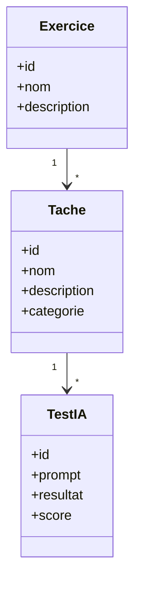

# ArtificialInquiries_EXE_NUM-6
# Artificial Inquiries – Exercice 6
## Design Your AI Test

### Nom du dépôt

```text
ArtificialInquiries_numEx
```

> `numEx` doit être remplacé par le numéro réel de l'exercice.

---

## 1. Présentation de l'exercice

L'exercice **Design Your AI Test** a pour objectif de concevoir un test permettant d'évaluer les capacités et les limites d'un modèle de langage (**LLM – Large Language Model**) dans le cadre de tâches professionnelles réelles.

L'idée principale est d'identifier les tâches qui représentent le cœur de notre activité professionnelle, puis de sélectionner quatre tâches permettant de construire un test d'IA représentatif.

Les quatre tâches sélectionnées doivent être suffisamment différentes pour permettre d'observer plusieurs capacités d'un modèle d'intelligence artificielle : compréhension, analyse, génération, raisonnement, résolution de problèmes et production de solutions techniques.

L'exercice est organisé autour de trois étapes principales :

1. Identifier et classer les différentes tâches professionnelles.
2. Sélectionner quatre tâches centrales représentant le travail réalisé.
3. Réfléchir aux possibilités et aux limites de la délégation de ces tâches à une IA.

---

## 2. Objectifs de l'exercice

Les objectifs principaux sont :

- Identifier les tâches réalisées dans le cadre de notre activité.
- Distinguer les tâches que nous devons réaliser de celles que nous apprécions.
- Identifier les tâches communes aux deux catégories.
- Sélectionner quatre tâches représentatives de notre pratique professionnelle.
- Concevoir un test permettant d'évaluer un modèle de langage.
- Observer les capacités d'un LLM à réaliser ces tâches.
- Identifier les erreurs et les limites éventuelles du modèle.
- Déterminer quelles tâches peuvent être assistées par une IA.
- Identifier les tâches nécessitant une validation humaine.

L'objectif n'est donc pas uniquement de vérifier si une IA peut produire une réponse, mais de déterminer si cette réponse est réellement **pertinente, correcte et exploitable dans un contexte professionnel**.

---

## 3. Première partie – Classification des tâches

La première étape consiste à identifier les différentes tâches réalisées dans le cadre de notre activité professionnelle.

Les tâches sont ensuite réparties selon deux critères :

- **Ce que je dois faire**
- **Ce que j'aime faire**

Cette classification permet d'obtenir trois catégories :

```text
                    CE QUE JE DOIS FAIRE
                           │
              ┌────────────┴────────────┐
              │                         │
              │         LES DEUX        │
              │                         │
              │    Ce que je dois       │
              │    faire et que         │
              │    j'aime faire         │
              │                         │
              └────────────┬────────────┘
                           │
                    CE QUE J'AIME FAIRE
```

Cette étape permet d'identifier les activités qui représentent le mieux notre pratique professionnelle.

---

## 4. Deuxième partie – Sélection des quatre tâches centrales

À partir de la classification précédente, quatre tâches principales sont sélectionnées.

Ces quatre tâches sont liées à un profil orienté vers l'**Intelligence Artificielle et les Systèmes d'Information**.

### Tâche 1 – Analyse et préparation des données

#### Description

La première tâche consiste à analyser, nettoyer et préparer des données avant leur utilisation dans un système d'intelligence artificielle.

Les opérations peuvent notamment comprendre :

- exploration des données ;
- identification des valeurs manquantes ;
- détection des valeurs incohérentes ;
- suppression des doublons ;
- encodage des variables catégorielles ;
- normalisation ou standardisation ;
- sélection des variables pertinentes ;
- détection des problèmes de fuite de données (*data leakage*).

#### Intérêt pour le test d'IA

Cette tâche permet d'évaluer si un LLM est capable de comprendre un jeu de données et de proposer une méthode de préparation adaptée au problème.

L'IA ne doit pas seulement produire du code. Elle doit également être capable de justifier les transformations proposées.

---

### Tâche 2 – Développement et évaluation d'un modèle d'IA

#### Description

La deuxième tâche consiste à développer, entraîner et évaluer un modèle d'apprentissage automatique permettant de résoudre un problème de classification ou de prédiction.

Les principales étapes sont :

- analyse du problème ;
- choix d'un algorithme ;
- préparation des données ;
- séparation des données d'entraînement et de test ;
- entraînement du modèle ;
- réglage des hyperparamètres ;
- évaluation des performances ;
- comparaison de plusieurs modèles ;
- interprétation des résultats.

#### Intérêt pour le test d'IA

Cette tâche permet d'évaluer la capacité d'un LLM à choisir une méthode adaptée, à produire une implémentation fonctionnelle et à interpréter correctement les résultats obtenus.

Les métriques peuvent notamment inclure :

- Accuracy ;
- Precision ;
- Recall ;
- F1-score ;
- ROC-AUC.

Une attention particulière doit être portée à la validité de la méthodologie utilisée afin d'éviter, par exemple, la fuite de données ou une mauvaise interprétation des performances.

---

### Tâche 3 – Développement d'une application ou d'une API

#### Description

La troisième tâche consiste à transformer une solution d'intelligence artificielle en une application ou une API utilisable.

Une solution peut notamment utiliser :

- Python ;
- FastAPI ;
- REST API ;
- Docker ;
- une base de données ;
- un modèle d'apprentissage automatique.

L'architecture générale peut être représentée de la manière suivante :

```text
Utilisateur
    │
    ▼
Interface utilisateur
    │
    ▼
API REST
    │
    ▼
Backend
    │
    ├──────────────► Base de données
    │
    ▼
Modèle d'IA
    │
    ▼
Résultat
```

#### Intérêt pour le test d'IA

Cette tâche permet de vérifier si une IA est capable de passer de la conception d'une solution à son intégration dans une application fonctionnelle.

Elle permet également de tester la capacité du LLM à :

- produire du code ;
- organiser un projet ;
- créer une API ;
- intégrer un modèle d'IA ;
- corriger des erreurs ;
- expliquer son implémentation.

---

### Tâche 4 – Conception d'une architecture de système d'information

#### Description

La quatrième tâche consiste à concevoir l'architecture d'un système d'information à partir de besoins fonctionnels et techniques.

Il faut notamment :

- identifier les besoins ;
- identifier les composants du système ;
- choisir les technologies ;
- définir les interactions entre les composants ;
- organiser les données ;
- prendre en compte la sécurité ;
- prendre en compte la maintenabilité ;
- prendre en compte la possibilité d'évolution du système.

#### Intérêt pour le test d'IA

Cette tâche est particulièrement intéressante pour tester un LLM car elle nécessite davantage qu'une simple génération de code.

L'IA doit être capable de :

- comprendre les besoins ;
- proposer une architecture cohérente ;
- justifier ses choix ;
- identifier les contraintes ;
- comparer plusieurs solutions ;
- anticiper certains problèmes.

---

## 5. Troisième partie – Réflexion sur l'utilisation de l'IA

Après avoir sélectionné les quatre tâches, l'objectif est d'étudier ce qui peut être délégué à une IA et ce qui nécessite une intervention humaine.

Un LLM peut notamment être utilisé pour :

- générer du code ;
- proposer des méthodes d'analyse ;
- expliquer des concepts ;
- proposer des architectures ;
- identifier certaines erreurs ;
- produire de la documentation ;
- automatiser certaines tâches répétitives.

Cependant, les résultats générés doivent être vérifiés.

Une IA peut par exemple :

- utiliser une méthode inappropriée ;
- produire du code incorrect ;
- faire des hypothèses erronées ;
- ignorer certaines contraintes ;
- introduire une vulnérabilité de sécurité ;
- produire des résultats difficiles à interpréter.

La validation humaine reste donc nécessaire.

---

## 6. Méthode de réalisation du test

Pour chaque tâche sélectionnée, une procédure similaire sera utilisée.

### Étape 1 – Définir le problème

Décrire précisément :

- le contexte ;
- l'objectif ;
- les données disponibles ;
- les contraintes ;
- le résultat attendu.

### Étape 2 – Préparer le prompt

Un prompt précis est préparé afin de demander au LLM de réaliser la tâche.

Le prompt doit fournir suffisamment de contexte pour que la comparaison soit pertinente.

### Étape 3 – Soumettre la tâche au LLM

Le problème est soumis au modèle d'intelligence artificielle.

La réponse obtenue est conservée afin de pouvoir l'analyser.

### Étape 4 – Implémenter la solution

Lorsque le LLM produit du code ou une solution technique, celle-ci est exécutée et testée.

### Étape 5 – Vérifier la solution

La solution est évaluée selon plusieurs critères :

- exactitude ;
- fonctionnement ;
- pertinence ;
- qualité technique ;
- respect des contraintes ;
- sécurité ;
- facilité de maintenance.

### Étape 6 – Analyser les limites

Les erreurs éventuelles sont identifiées et documentées.

Cette étape permet de déterminer les situations dans lesquelles une intervention humaine reste nécessaire.

---

## 7. Solutions techniques utilisées

Les technologies utilisées pour réaliser et documenter l'exercice sont les suivantes :

| Technologie | Utilisation |
|---|---|
| **Python** | Développement et expérimentation |
| **Pandas** | Analyse et préparation des données |
| **NumPy** | Manipulation des données numériques |
| **Scikit-learn** | Machine Learning |
| **XGBoost** | Modèles de classification et prédiction |
| **FastAPI** | Développement d'API REST |
| **Docker** | Conteneurisation |
| **MySQL** | Gestion des données relationnelles |
| **PHP** | Fonctionnement d'Omeka S |
| **Apache** | Serveur web local |
| **Omeka S** | Gestion et exposition des données |
| **Mermaid** | Création du diagramme de classes |
| **Git** | Gestion des versions |
| **GitHub** | Hébergement du dépôt et collaboration |
| **Markdown** | Documentation |

---

## 8. Organisation du dépôt GitHub

Le dépôt est organisé de la manière suivante :

```text
ArtificialInquiries_numEx/
│
├── README.md
│
├── diagram_class.md
│
├── tasks/
│   ├── task1_data_analysis.md
│   ├── task2_ai_model.md
│   ├── task3_api.md
│   └── task4_architecture.md
│
├── prompts/
│   └── prompts.md
│
├── results/
│   └── evaluation.md
│
└── docs/
    └── annotations.md
```

### `README.md`

Contient la présentation générale de l'exercice, les objectifs, les tâches sélectionnées et les solutions techniques utilisées.

### `diagram_class.md`

Contient le diagramme de classes réalisé avec **Mermaid** pour représenter les données nécessaires à l'exercice.

### `tasks/`

Contient la description détaillée des quatre tâches sélectionnées.

### `prompts/`

Contient les prompts utilisés pour tester les capacités du modèle d'IA.

### `results/`

Contient les résultats des tests et leur évaluation.

### `docs/`

Contient la documentation complémentaire, notamment les éléments liés aux annotations.

---

## 9. Diagramme de classes avec Mermaid

Le diagramme de classes nécessaire à la gestion des données de l'exercice sera réalisé avec **Mermaid**.

Le fichier correspondant est :

```text
diagram_class.md
```

La syntaxe Mermaid permet de représenter les classes, leurs attributs et leurs relations.

Exemple de structure :



Le diagramme sera adapté aux données réellement utilisées dans l'exercice.

---

## 10. Installation et test d'Omeka S

Une partie technique de l'exercice consiste également à installer **Omeka S** localement.

L'environnement demandé est basé sur :

```text
Apache
PHP
MySQL
Omeka S
```

L'architecture locale peut être représentée ainsi :

```text
Navigateur
    │
    ▼
Apache
    │
    ▼
Omeka S
    │
    ▼
PHP
    │
    ▼
MySQL
```

### Installation

L'installation consiste à :

1. Installer un environnement serveur local.
2. Installer et configurer Apache.
3. Installer PHP avec les extensions nécessaires.
4. Installer MySQL.
5. Télécharger et installer Omeka S.
6. Configurer la connexion à la base de données.
7. Configurer le serveur Apache.
8. Accéder à l'interface d'installation d'Omeka S.
9. Créer le compte administrateur.
10. Vérifier le fonctionnement de l'application.

### Test d'Omeka S

Après l'installation, plusieurs vérifications doivent être réalisées :

- accès à l'interface d'administration ;
- connexion à la base de données ;
- création d'un élément ;
- modification d'un élément ;
- consultation des données ;
- vérification du stockage des informations ;
- vérification du fonctionnement général de l'application.

L'objectif est de confirmer que l'environnement Omeka S fonctionne correctement en local.

---

## 11. Annotations du document Artificial Inquiries

L'exercice comprend également la poursuite des annotations du document **Artificial Inquiries**.

Les annotations doivent être réalisées en suivant le protocole de surlignage indiqué par l'enseignant.

Le document de référence utilise le protocole fourni dans l'agenda du cours.

L'objectif est d'identifier et d'annoter les informations importantes du document afin de faciliter son analyse et son exploitation dans le cadre de l'exercice.

Les annotations réalisées pourront ensuite être conservées dans la documentation du projet.

---

## 12. Évaluation des solutions produites par l'IA

Les solutions produites par l'IA seront évaluées selon les critères suivants :

| Critère | Description |
|---|---|
| **Exactitude** | La réponse ou le code est-il correct ? |
| **Pertinence** | La solution répond-elle réellement au problème ? |
| **Qualité technique** | Les choix techniques sont-ils adaptés ? |
| **Fonctionnement** | La solution fonctionne-t-elle après test ? |
| **Explication** | Les choix sont-ils correctement justifiés ? |
| **Robustesse** | La solution résiste-t-elle aux différents cas ? |
| **Sécurité** | Les risques de sécurité sont-ils pris en compte ? |
| **Intervention humaine** | Quel niveau de contrôle humain est nécessaire ? |

Une notation de **1 à 5** peut être utilisée :

```text
1 = Très insuffisant
2 = Insuffisant
3 = Moyen
4 = Bon
5 = Très bon
```

---

## 13. Résultats attendus

À la fin de l'exercice, le dépôt doit contenir :

- le README présentant l'exercice ;
- les quatre tâches principales sélectionnées ;
- le diagramme de classes Mermaid ;
- les prompts utilisés pour tester l'IA ;
- les résultats des tests ;
- l'analyse des performances de l'IA ;
- les limites identifiées ;
- les éléments liés aux annotations ;
- la documentation de l'installation et du test d'Omeka S.

---

## 14. Conclusion

L'exercice **Design Your AI Test** permet d'étudier de manière concrète la capacité d'un modèle de langage à réaliser différentes tâches liées à un contexte professionnel.

Les quatre tâches sélectionnées couvrent plusieurs dimensions :

1. **Analyse et préparation des données**
2. **Développement et évaluation de modèles d'IA**
3. **Développement d'applications et d'API**
4. **Conception d'architectures de systèmes d'information**

La réalisation de l'exercice permet également de mettre en place un environnement technique comprenant GitHub, Mermaid et Omeka S.

L'objectif final est de ne pas considérer l'IA comme un simple outil de génération automatique, mais d'évaluer de manière critique ses capacités, ses limites et le niveau de supervision humaine nécessaire.

Le projet permet ainsi de répondre à une question centrale :

> **Dans quelle mesure une intelligence artificielle peut-elle réellement prendre en charge des tâches professionnelles complexes, et dans quelles situations l'expertise humaine reste-t-elle indispensable ?**
