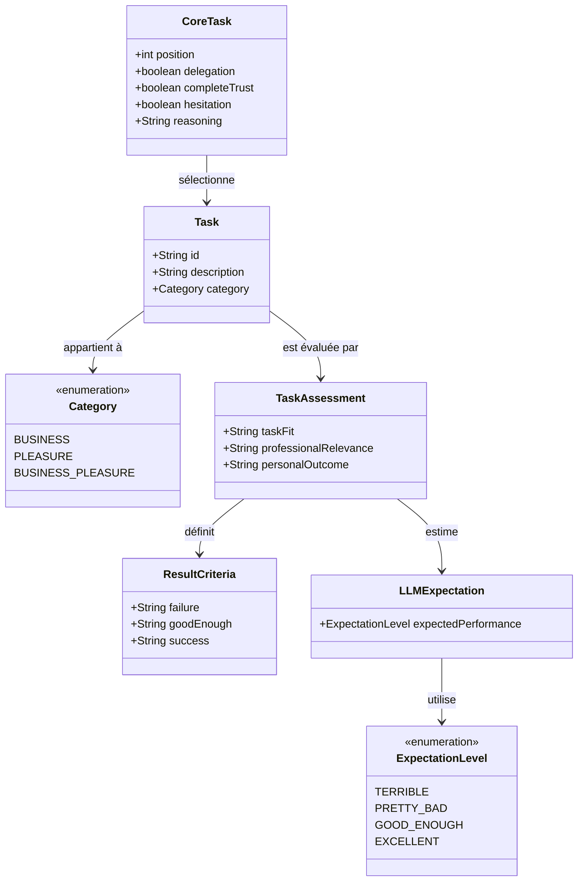

# Diagramme de classes : sélection des tâches

```mermaid
classDiagram
    class CoreTask {
        +int position
        +boolean delegation
        +boolean completeTrust
        +boolean hesitation
        +String reasoning
    }

    class Task {
        +String id
        +String description
        +Category category
    }

    class Category {
        <<enumeration>>
        BUSINESS
        PLEASURE
        BUSINESS_PLEASURE
    }

    class TaskAssessment {
        +String taskFit
        +String professionalRelevance
        +String personalOutcome
    }

    class ResultCriteria {
        +String failure
        +String goodEnough
        +String success
    }

    class LLMExpectation {
        +ExpectationLevel expectedPerformance
    }

    class ExpectationLevel {
        <<enumeration>>
        TERRIBLE
        PRETTY_BAD
        GOOD_ENOUGH
        EXCELLENT
    }

    CoreTask --> Task : sélectionne
    Task --> Category : appartient à
    Task --> TaskAssessment : est évaluée par
    TaskAssessment --> ResultCriteria : définit
    TaskAssessment --> LLMExpectation : estime
    LLMExpectation --> ExpectationLevel : utilise
```
